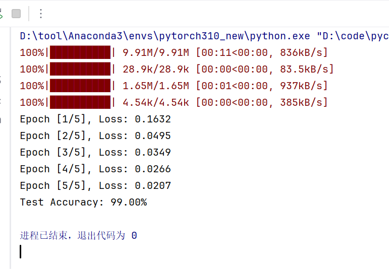

# CNN入门练习 day-1
今天练习CNN入门代码，主要运用了Pytorch库、CNN、MNIST数据库和代码统一判断使用的是cpu/gpu。

代码思路为：
- **超参数**：设置了每个批次的样本数、训练次数、学习率以及通过device统一检测使用cpu/gpu
- **数据加载**：首先定义了一个数据预处理方法transform，将图像转换成张量并在将像素值缩放至【0，1】后进行标准化处理。创建训练、测试数据集对象，并在其中对MNIST数据库调用transfrom实现预处理。
- **CNN模型**：定义了SimpleCNN类，继承了nn.Modle，并定义了一个self的实体，进行初始化操作。后续将数据通过CNN进行卷积处理。定义了前向传播函数，将数据转换成全连接层二维输入类型
- **损失函数&优化器**：定义了交叉熵损失函数及导入了设定学习率的Adam优化器
- **训练函数**：设置成训练模式后，逐批导出数据集中的图像和标签并转移至device指定的设备，将根据图像得到预测结果和标签进行对比，得到损失值。消除累积梯度后更新模型参数
- **测试函数**：设置成测试函数后，根据图像卷积后得到的预测结果中的最大值索引得到预测类别，并将其与真实标签进行对比，统计正确个数
- **运行入口**：调用train()和test)函数，得到结果

以下为源代码：
```bash
import torch    # 导入 PyTorch 核心库，提供张量操作、自动求导、GPU 支持等
import torch.nn as nn    # 导入神经网络模块，包含各种层（Linear, Conv2d, 等）和损失函数
import torch.optim as optim     # 导入优化器模块，包含 SGD、Adam 等优化算法
from torchvision import datasets, transforms    # 从 torchvision 导入数据集（MNIST）和图像预处理工具
from torch.utils.data import DataLoader     # 导入数据加载器，用于批量迭代数据集

# =====================
# 1. 超参数
# =====================
batch_size = 64    # 每个训练批次包含的样本数量
learning_rate = 0.001    # 优化器的学习率，控制参数更新步长
epochs = 5    # 整个训练集遍历的次数
device = torch.device("cuda" if torch.cuda.is_available() else "cpu")
# 检测当前环境是否支持 CUDA（NVIDIA GPU），若支持则使用 GPU，否则使用 CPU

# =====================
# 2. 数据加载（MNIST）
# =====================
transform = transforms.Compose([    # 定义一个数据预处理流水线
    transforms.ToTensor(),
# 将 PIL 图像或 numpy 数组转换为 PyTorch 张量，并自动将像素值从 [0,255] 缩放到 [0,1]
    transforms.Normalize((0.1307,), (0.3081,))
# 按通道进行标准化：减去均值 0.1307，除以标准差 0.3081（MNIST 的预计算统计值）
])

train_dataset = datasets.MNIST(    # 创建 MNIST 训练数据集对象
    root="./data",     # 数据集存储根目录，若不存在会自动下载
    train=True,    # 加载训练集（60000 张图片）
    download=True,    # 若本地没有数据则从网络下载
    transform=transform    # 应用上面定义的预处理
)
test_dataset = datasets.MNIST(     # 创建测试数据集对象
    root="./data",
    train=False,    # 加载测试集（10000 张图片）
    download=True,
    transform=transform
)

train_loader = DataLoader(    # 创建训练数据加载器
    train_dataset,    # 传入训练数据集
    batch_size=batch_size,    # 每批样本数（64）
    shuffle=True    # 每个 epoch 开始时打乱数据顺序，增加随机性
)
test_loader = DataLoader(    # 创建测试数据加载器
    test_dataset,
    batch_size=batch_size,
    shuffle=False    # 测试时无需打乱，顺序固定即可
)

# =====================
# 3. CNN模型（经典结构）
# =====================
class SimpleCNN(nn.Module):    # 定义 CNN 类，继承自 nn.Module
    def __init__(self):     # 构造函数，初始化网络层
        super(SimpleCNN, self).__init__()    # 调用父类 nn.Module 的初始化方法，固定写法

        self.conv = nn.Sequential(    # 使用 Sequential 容器串联卷积部分各层
            nn.Conv2d(1, 16, kernel_size=3, stride=1, padding=1),
            # 第一层卷积：输入通道 1（灰度图），输出通道 16，卷积核 3×3，步长 1，padding 1 → 输出尺寸不变（28×28）
            nn.ReLU(),    # ReLU 激活函数，增加非线性
            nn.MaxPool2d(2),
            # 最大池化，核大小 2×2，步长默认等于核大小 → 特征图尺寸减半（28→14）

            nn.Conv2d(16, 32, kernel_size=3, stride=1, padding=1),
            # 第二层卷积：输入 16 通道，输出 32 通道，尺寸仍保持不变（14×14）
            nn.ReLU(),
            nn.MaxPool2d(2)     # 再次池化，尺寸减半（14→7）
        )

        self.fc = nn.Sequential(    # 全连接（分类）部分
            nn.Linear(32 * 7 * 7, 128),
            # 将卷积输出的特征图展平后输入全连接层：输入维度 32×7×7 = 1568，输出维度 128
            nn.ReLU(),
            nn.Linear(128, 10)
            # 第二层全连接：输出维度 10（对应 MNIST 的 10 个类别）
        )

    def forward(self, x):    # 定义前向传播
        x = self.conv(x)    # 将输入 x 通过卷积部分
        x = x.view(x.size(0), -1)
        # 展平：保留 batch 维度（x.size(0)），其余维度合并为 -1（即 32*7*7）
        x = self.fc(x)     # 通过全连接部分
        return x
        # 返回输出 logits（未经过 softmax，因为 CrossEntropyLoss 内部包含 softmax）


model = SimpleCNN().to(device)    # 实例化模型，并移动到指定设备（CPU 或 GPU）

# =====================
# 4. 损失函数 & 优化器
# =====================
criterion = nn.CrossEntropyLoss()
# 定义交叉熵损失函数，适用于多分类任务（内部自动进行 softmax + 负对数似然）
optimizer = optim.Adam(model.parameters(), lr=learning_rate)
# 使用 Adam 优化器，传入模型的所有可训练参数，设置学习率

# =====================
# 5. 训练函数
# =====================
def train():     # 定义训练函数
    model.train()
    # 将模型设置为训练模式（启用 dropout、batchnorm 等训练专用层，本例没有这些，但属良好习惯）
    for epoch in range(epochs):    # 外层循环：遍历每个 epoch
        total_loss = 0    # 累计当前 epoch 的总损失

        for images, labels in train_loader:
            # 内层循环：从训练数据加载器中逐批取出图像和标签
            images, labels = images.to(device), labels.to(device)
            # 将数据移至指定设备（GPU/CPU）

            outputs = model(images)    # 前向传播：将图像输入模型，得到预测 logits
            loss = criterion(outputs, labels)    # 计算损失值

            optimizer.zero_grad()    # 清除之前累积的梯度，避免梯度叠加
            loss.backward()     # 反向传播：计算当前损失关于所有参数的梯度
            optimizer.step()     # 更新模型参数（根据梯度和学习率）

            total_loss += loss.item()    # 累加当前批次的损失值（item() 取出标量）

        print(f"Epoch [{epoch+1}/{epochs}], Loss: {total_loss/len(train_loader):.4f}")
        # 每个 epoch 结束后，打印平均损失（总损失除以批次数）

# =====================
# 6. 测试函数
# =====================
def test():    # 定义测试函数
    model.eval()
    # 将模型设置为评估模式（关闭 dropout 等，本例无 dropout，但属良好习惯）
    correct = 0    # 记录正确预测的样本数
    total = 0    # 记录总样本数

    with torch.no_grad():
        # 禁用梯度计算，节省内存并加速，因为测试时不需要反向传播
        for images, labels in test_loader:    # 遍历测试数据加载器
            images, labels = images.to(device), labels.to(device)    # 数据移至设备
            outputs = model(images)    # 前向传播，得到 logits

            _, predicted = torch.max(outputs.data, 1)
            # 在类别维度（dim=1）取最大值索引，得到预测类别；忽略最大值本身（用 _ 占位）
            total += labels.size(0)
            # 累加当前批次的实际样本数（labels 的第一维大小）
            correct += (predicted == labels).sum().item()
            # 比较预测与真实标签，统计正确个数（布尔值求和转为整数）

    print(f"Test Accuracy: {100 * correct / total:.2f}%")
    # 计算并打印准确率百分比

# =====================
# 7. 运行入口
# =====================
if __name__ == "__main__":
    train()
    test()
```

代码运行结果如下:


